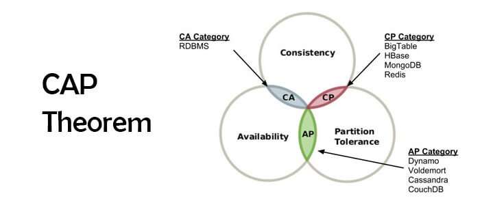

# Python libraries for mognodb

## SQL and NO-SQL

SQL - это реляционные базы данных, в которых данные хранятся в строго упорядочином виде в тамблицах, которые могут быть связаны сежду собой.

NO-SQL - это Not Only SQL и сюда уже подпадает большое разнообразие баз данных. Основные типы NO-SQL баз данных:

- `key-value` - данные хранятся как в хеш таблице, ключ к которому привязанны какие-то данные.
- `column` - база данных, в которой данные группируются не по строкам, а по столбцам.
- `document` - в таких базах данных данные хранятся в документах
- `grapg` - данные храняться в виде графа


Преймуществом NO-SQL баз является не жосткая структура данных, а также простота горизонтального маштабирования.

## CAP

Теорема CAP (известная также как теорема Брюера) — эвристическое утверждение о том, что в любой реализации распределённых вычислений возможно обеспечить не более двух из трёх следующих свойств:

- `согласованность данных` (англ. consistency) — во всех вычислительных узлах в один момент времени данные не противоречат друг другу;
- `доступность` (англ. availability) — любой запрос к распределённой системе завершается корректным откликом, однако без гарантии, что ответы всех узлов системы совпадают;
- `устойчивость к разделению` (англ. partition tolerance) — расщепление распределённой системы на несколько изолированных секций не приводит к некорректности отклика от каждой из секций.



## MongoDB

`MongoDB` - это NO SQL база данных котороя позволяет хранить неструктурированные данные как колекции документов. Формат документа похож на `JSON`:

```json
{
  "_id": 1,
  "name" : { "first" : "John", "last" : "Backus" },
  "contribs" : [ "Fortran", "ALGOL", "Backus-Naur Form", "FP" ],
  "awards" : [
    {
      "award" : "W.W. McDowell Award",
      "year" : 1967,
      "by" : "IEEE Computer Society"
    }, {
      "award" : "Draper Prize",
      "year" : 1993,
      "by" : "National Academy of Engineering"
    }
  ]
}
```

На самом деле данные хранятся в виде BSON (binary structured object notation), он имеет больше типов полей и хранится более компактно в памяти.

## Mongo libraries

Для python существует множество библиотек для работы с mongodb. Мы рассмотрим некоторые из них:

- pymongo
- motor
- mongoengine
- odmantic
- beanie


## Aggregation

**Aggregation framework** - это набор инструментов расширяющий возможности `MongoDB` за пределы MQL (Mongo query language). `Aggregation framework` можно представить как набор последовательных шагов которые принимают на вход какие-то данные, обрабатывают их и передают дальше. Таким образом можно строить всевозможные пайплайны используя встроенные инструменты `MognoDB`.


## ODM


**ODM** (Object Document Mapping) - это прослойка позволяющая работать с обьектами в базе данных как с обьектами классов. По сути тоже самое что и ORM но только для NO SQL баз данных таких как MongoDB которые хранят данные в виде документов.

## Examples

Примеры представлены в виде jupiter notebooks. Для того чтоб они работали необходимо установить зависимости и иметь запущенную MongoDB, проще всего монгу поднять в контейнере используя docker-compose.yml

## Conclusion

- Если необходим полный контроль и гибкость при работе с монгой то стоит выбрать `pymongo` или `motor`.

- Если нужна серьезная синхронная ODM то это точно `mongoengine`.

- Если хотите использовать монгу с каким-то асинхронным фреймворком типо FastApi то точно стоит обрать внимание на `Beanie`

## Resources:

Docs:
- [pymongo](https://pymongo.readthedocs.io/en/stable/)
- [motor](https://motor.readthedocs.io/en/stable/)
- [mongoengine](https://docs.mongoengine.org/)
- [Odmantic](https://art049.github.io/odmantic/)
- [Beanie](https://roman-right.github.io/beanie/)
Youtube:
- https://www.youtube.com/watch?v=E-1xI85Zog8
- https://www.youtube.com/watch?v=kWd7ErXMlqQ
